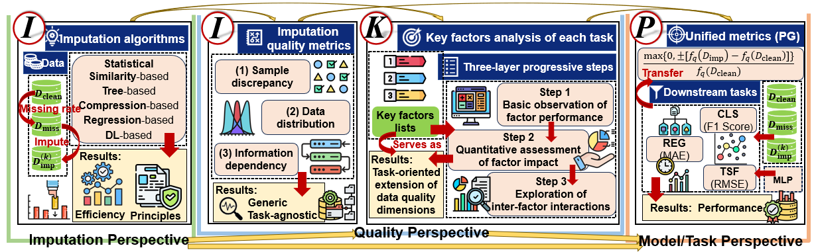

# Task-Centric Evaluation of Missing Data Imputation Beyond Reconstruction

<p align="center">
    
</p>

This repository contains the source code, scripts, datasets, and extended version of paper for the IIKP-Path. The evaluation process of IIKP-Path consists of four stages: imputation algorithm analysis, imputation quality assessment, key factos analysis, and performance evaluation. This repository provides all the necessary content for implementing these four stages. The KFBF algorithm, extended experiments on deep time series models, and pruning recommendation method are all integrated. We hope this repository will assist users in achieving comprehensive task-centric evaluation of missing data imputation.


## Repository Structure
- `Datasets/`: All datasets.
    - In each dataset, 
        - `Data_Quality/`: This records the results of imputation quality assessment on this dataset, including: KS Test, KL Divergence, 2-Wasserstein Distance, Sliced Wasserstein Distance, and Mutual Information.
        - `Imputation/`: This records the imputed datasets.
        - `Mechanism/`: This records the results of key factors analysis.
        - `null/`: This records the dataset after missing value injection.
        - `clean.csv`: This is the original clean data.
- `Imputation_Algorithms/`: The imputation algorithms and their running time.
    - `Categorical/`: The imputation algorithms for categorical attributes.
    - `Numerical/`: The imputation algorithms for numerical attributes.
    - `Time_Record/`: The running time results. 
- `Imputation_Analysis/`: Imputation analysis and the results.
    - `Results_numerical/`: The results of imputation analysis.
    - `hdi_analysis_numerical.py`: The imputation analysis for HDI.
    - `knn_analysis_numerical.py`: The imputation analysis for KNN.
    - `mice_analysis_numerical.py`: The imputation analysis for MICE.
    - `si_analysis_numerical.py`: The imputation analysis for SI.
- `Data_Quality/`: Code for imputation quality assessment, including: KS Test, KL Divergence, 2-Wasserstein Distance, Sliced Wasserstein Distance, and Mutual Information.
- `Mechanism/`: Code for key factors analysis
    - `classification/`: Key factors analysis for classification.
        - `factors_relation_results/`: The relationship of class discriminability & label correctness ratio.
        - `class_discriminability/`: Calculate the class discriminability of each dataset, and the results will be saved to the `Mechanism` of each dataset in `Datasets`.
        - `discriminability_precision/`: The KFBF algorithm, get the upper and lower bound.
        - `discriminability_precision_random/`: Get the random generated dataset(random class discriminability of the fixed label correctness ratio).
        - `factors_relation/`: Calculate the relationship of class discriminability & label correctness ratio, and the results will be saved to the `Mechanism/ classification/ factors_relation_results`.
        - `label_correctness_ratio/`: Calculate the label correctness ratio of each dataset, and the results will be saved to the `Mechanism` of each dataset in `Datasets`.
    - `regression/`: Key factors analysis for regression
        - `factors_relation_results/`: The relationship of feature-target correlation & imputation bias.
        - `factors_relation/`: Calculate the relationship of feature-target correlation & imputation bias, and the results will be saved to the `Mechanism/ regression/ factors_relation_results`.
        - `feature_target_corr/`: Calculate the feature-target correlation of each dataset, and the results will be saved to the `Mechanism` of each dataset in `Datasets`.
        - `imputation_deviation/`: Calculate the imputation bias of each dataset, and the results will be saved to the `Mechanism` of each dataset in `Datasets`.
    - `timeseries/`: Key factors analysis for time series forecasting.
        - `decompose_basic/`
            - `decompose_basic.py`: Perform basic seasonal decomposition on time series.
        - `decompose_change_bad/`
            - `resid.py`: The component_O1 and component_O2 are processed, component_T is residual. 
            - `seasonal.py`: The component_O1 and component_O2 are processed, component_T is seasonality.
            - `trend.py`: The component_O1 and component_O2 are processed, component_T is trend.
        - `decompose_change_good/`
            - `resid.py`: The component_O1 and component_O2 are unprocessed, component_T is residual.
            - `seasonal.py`: The component_O1 and component_O2 are unprocessed, component_T is seasonality.
            - `trend.py`: The component_O1 and component_O2 are unprocessed, component_T is trend.
        - `decompose_replace/`
            - `resid.py`: Replace the residual.
            - `seasonal.py`: Replace the seasonality.
            - `trend.py`: Replace the trend.
- `Downstream_Tasks`: The code for performance evaluation.
    - `classification/`: The classification Tasks.
        - `test_discriminability_precision.py`: Evaluate the performance of datasets corresponding to the upper and lower bounds of class discriminability.
        - `test_discriminability_precision_random.py`: Evaluate the performance of the randomly generated datasets during the process of calculating the upper and lower bounds of class discriminability.
        - `test_imputation.py`: Evaluation the performance of clean datasets, missing datasets and imputed datasets.
        - `test_imputation_forPruningTest.py`: Evaluation the performance of datasets that is for pruning test, including the original dataset, history dataset and test dataset. 
    - `regression/`: The regression tasks.
        - `test_imputation.py`: Evaluation the performance of clean datasets, missing datasets and imputed datasets.
        - `test_imputation_forPruningTest`: Evaluation the performance of datasets that is for pruning test, including the original dataset, history dataset and test dataset. 
    - `timeseries/`: The time series forecasting tasks.
        - `layers`: It helps the implementation of TimeMixer. And the code is from [Time-Series-Library](https://github.com/thuml/Time-Series-Library)
        - `test_decompose_change_bad.py`: Evaluate the performance of datasets whose component_O1 and component_O2 are processed. The model is MLP.
        - `test_decompose_change_bad_LightTS.py`: Evaluate the performance of datasets whose component_O1 and component_O2 are processed. The model is LightTS.
        - `test_decompose_change_bad_TimeMixer.py`: Evaluate the performance of datasets whose component_O1 and component_O2 are processed. The model is TimeMixer.
        - `test_decompose_change_bad_TSMixer.py`: Evaluate the performance of datasets whose component_O1 and component_O2 are processed. The model is TSMixer.
        - `test_decompose_change_good.py`: Evaluate the performance of datasets whose component_O1 and component_O2 are unprocessed. The model is MLP.
        - `test_decompose_change_good_LightTS.py`: Evaluate the performance of datasets whose component_O1 and component_O2 are unprocessed. The model is LightTS.
        - `test_decompose_change_good_TimeMixer.py`: Evaluate the performance of datasets whose component_O1 and component_O2 are unprocessed. The model is TimeMixer.
        - `test_decompose_change_good_TSMixer.py`: Evaluate the performance of datasets whose component_O1 and component_O2 are unprocessed. The model is TSMixer.
        - `test_decompose_replace.py`: Evaluate the performance of datasets whose component has been replaced. The model is MLP.
        - `test_decompose_replace_LightTS.py`: Evaluate the performance of datasets whose component has been replaced. The model is LightTS.
        - `test_decompose_replace_TimeMixer.py`: Evaluate the performance of datasets whose component has been replaced. The model is TimeMixer.
        - `test_decompose_replace_TSMixer.py`: Evaluate the performance of datasets whose component has been replaced. The model is TSMixer.
        - `test_imputation.py`: Evaluation the performance of clean datasets, missing datasets and imputed datasets. The model is MLP.
        - `test_imputation_forPruningTest.py`: Evaluation the performance of datasets that is for pruning test, including the original dataset, history dataset and test dataset. The model is MLP.
        - `test_imputation_LightTS.py`: Evaluation the performance of clean datasets, missing datasets and imputed datasets. The model is LightTS.
        - `test_imputation_TimeMixer.py`: Evaluation the performance of clean datasets, missing datasets and imputed datasets. The model is TimeMixer.
        - `test_imputation_TSMixer.py`: Evaluation the performance of clean datasets, missing datasets and imputed datasets. The model is TSMixer.
- `Downstream_Results/`: The resuls of performance evaluation.
- `RunScipts/`
    - `ForPruningTest/`: The scripts for pruning test.
        - `run_imputation_categorical_forPruningTest.py`: Impute the categorical attributes of datasets that are for pruning test.
        - `run_imputation_numerical_forPruningTest.py`: Impute the numerical attributes of datasets that are for pruning test.
        - `run_insert_null_forPruningTest.py`: Insert missing values into datasets that are for pruning test.
    - `run_data_quality.py`: The scripts for imputation quality assessment.
    - `run_imputation_categorical.py`: Impute the categorical attributes of datasets.
    - `run_imputaiton_numerical.py`: Impute the numerical attributes of datasets.
    - `run_insert_null.py`: Insert missing values into datasets.
- `util/`: Some figures.


## Setup
Create a virtual environment with Python 3.9 and install requirements through the provided environment.yml
```shell
conda env create -f environment.yml
conda activate IIKP_Path
```

## Usage
### Inject missing values
This console command injects missing values into target datasets.
```shell
python ./RunScripts/run_insert_null.py
```
### Imputation
(1) This console command implements imputation for numerical attributes.
```shell
python ./RunScripts/run_imputation_numerical.py
```

(2) This console command implements imputation for categorical attributes.
```shell
python ./RunScripts/run_imputation_categorical.py
```

(3) This console command provides the functionality to use a specific imputation method independently, for example
```shell
python ./Imputation_Algorithms/null-knn.py \
        --input_file \
        --output_file \
        --target_column \
        --nonnumerical_column
```
`input_file`: Path to the input dataset; `output_file`: Path where the imputed dataset will be saved; `target_column`: Target column to be imputed;`nonnumerical_column`: Additional non-numerical columns that require special processing during numerical attribute imputation

### Imputation quality assessment
This console command implements imputation quality assessment, calculating five metrics: KS test, KL divergence, 2-Wasserstein distance, sliced Wasserstein distance, and mutual information.
```shell
python ./RunScripts/run_data_quality.py
```

### Key factos analysis
Since the key factors are relatively complex, the `./Mechanism` directory provides all scripts. Taking the calculation of class discriminability for classification as an example,
```shell
python ./Mechanism/classification/class_discriminabilitys.py
```

### Performance evaluation
the `./Downstream_Tasks` directory provides all scripts. Taking the basic calculation for classification as an example,
```shell
python ./Downstream_Tasks/test_imputation.py
```

## Datasets
| task                    | dataset  | domain         | source                                                                                          |    
|-------------------------|----------|----------------|-------------------------------------------------------------------------------------------------|
| Classification          | Beers    | Industry       | <https://www.vldb.org/pvldb/vol13/p1948-mahdavi.pdf>                                            |
| Classification          | Flights  | Transportation | <https://www.vldb.org/pvldb/vol10/p1190-rekatsinas.pdf>                                         |  
| Classification          | Hospital | Healthcare     | <https://www.vldb.org/pvldb/vol10/p1190-rekatsinas.pdf>                                         | 
| Classification          | Red Wine | Industry       | <https://archive.ics.uci.edu/dataset/186/wine+quality>                                          | 
| Classification          | Avocado  | Agriculture    | <https://www.kaggle.com/datasets/amldvvs/avocado-ripeness-classification-dataset/data>          |
| Classification          | Glass    | Material       | <https://archive.ics.uci.edu/dataset/42/glass+identification>                                   |  
| Regression              | Concrete | Material       | <https://archive.ics.uci.edu/dataset/165/concrete+compressive+strength>                         |  
| Regression              | CCPP     | Energy         | <https://archive.ics.uci.edu/dataset/294/combined+cycle+power+plant>                            |  
| Regression              | Airfoil  | Aviation       | <https://archive.ics.uci.edu/dataset/291/airfoil+self+noise>                                    |  
| Regression              | Abalone  | Biology        | <https://archive.ics.uci.edu/dataset/1/abalone>                                                 |  
| Regression              | ParisHP  | Economic       | <https://www.kaggle.com/datasets/mssmartypants/paris-housing-price-prediction>                  |  
| Regression              | BostonHP | Economic       | <https://www.kaggle.com/datasets/vikrishnan/boston-house-prices/data>                           |  
| Time series forecasting | ETTh1    | Electricity    | <https://ojs.aaai.org/index.php/AAAI/article/view/17325>                                        |  
| Time series forecasting | ETTm1    | Electricity    | <https://ojs.aaai.org/index.php/AAAI/article/view/17325>                                        |  
| Time series forecasting | Illness  | Healthcare     | <https://proceedings.neurips.cc/paper/2021/hash/bcc0d400288793e8bdcd7c19a8ac0c2b-Abstract.html> |  
| Time series forecasting | Exchange | Economic       | <https://proceedings.neurips.cc/paper/2021/hash/bcc0d400288793e8bdcd7c19a8ac0c2b-Abstract.html> |  
| Time series forecasting | Weather  | Environment    | <https://proceedings.neurips.cc/paper/2021/hash/bcc0d400288793e8bdcd7c19a8ac0c2b-Abstract.html> |  
| Time series forecasting | ETTh2    | Electricity    | <https://ojs.aaai.org/index.php/AAAI/article/view/17325>                                        |  


## Parameters
Here we provide the actual parameters used in the downstream tasks after random grid search. The parameters for the imputation algorithms have already been configured in the code.

### Time Series Forecasting         
#### MLP
| dataset      | solver | max_iter | leaning_rate_init | hidden_layer_sizes | early_stopping | alpha  | activation | look_back |    
|--------------|--------|----------|-------------------|--------------------|----------------|--------|------------|-----------|
| ETTh1        | sgd    | 1000     | 0.1               | (100, 50, 30)      | True           | 0.001  | relu       | 20        | 
| ETTm1        | sgd    | 1000     | 0.1               | (100, 50)          | True           | 0.001  | relu       | 6         | 
| Illness      | adam   | 1000     | 0.1               | (100,)             | True           | 0.001  | relu       | 10        | 
| Exchange     | adam   | 1000     | 0.1               | (100, 50)          | True           | 0.001  | relu       | 8         | 
| Weather      | adam   | 1000     | 0.1               | (80,)              | True           | 0.001  | relu       | 5         | 
| ETTh2        | sgd    | 1000     | 0.1               | (50,)              | True           | 0.0001 | tanh       | 10        | 
 


#### TSMixer
| dataset      | num_epochs | e_layers | d_model | dropout | early_stopping |    
|--------------|------------|----------|---------|---------|----------------|
| ETTh1        | 80         | 2        | 50      | 0.3     | False          |
| ETTm1        | 30         | 2        | 20      | 0.1     | False          |
| Illness      | 20         | 2        | 15      | 0.15    | False          |
| Exchange     | 1000       | 1        | 15      | 0.1     | False          |
| Weather      | 1000       | 1        | 15      | 0.2     | False          |


#### LightTS
| dataset      | num_epochs | d_model | early_stopping | learning_rate |  
|--------------|------------|---------|----------------|---------------|
| ETTh1        | 1000       | 68      | False          | 0.0001        |
| ETTm1        | 1000       | 60      | True           | 0.0001        |
| Illness      | 100        | 128     | True           | 0.01          |
| Exchange     | 100        | 64      | True           | 0.01          |
| Weather      | 500        | 92      | True           | 0.0001        |


#### TimeMixer
| dataset      | num_epochs | e_layer | d_model | dropout | early_stopping |  
|--------------|------------|---------|---------|---------|----------------|
| ETTh1        | 15         | 4       | 32      | 0.1     | False          |
| ETTm1        | 15         | 2       | 36      | 0.1     | False          |
| Illness      | 50         | 2       | 32      | 0.1     | False          |
| Exchange     | 20         | 2       | 32      | 0.15    | False          |
| Weather      | 40         | 3       | 16      | 0.1     | False          |


### Classification   
| dataset         | solver | max_iter | leaning_rate_init | hidden_layer_sizes | early_stopping | alpha  | activation |    
|-----------------|--------|----------|-------------------|--------------------|----------------|--------|------------|
| Beers           | adam   | 1000     | 0.001             | (50, 20)           | False          | 0.0001 | relu       |          
| Flights         | adam   | 1000     | 0.001             | (100,)             | False          | 0.0001 | relu       |           
| Hospital        | adam   | 1000     | 0.001             | (50,)              | False          | 0.0001 | relu       |
| RedWineQuality  | adam   | 1000     | 0.0001            | (100,)             | False          | 0.0001 | relu       |
| AvocadoRipeness | adam   | 1000     | 0.1               | (50,)              | False          | 0.1    | relu       |
| Glass           | adam   | 1000     | 0.0001            | (50, 20)           | False          | 0.1    | relu       |


### Regression
| dataset          | solver | max_iter | leaning_rate_init | hidden_layer_sizes | early_stopping | alpha  | activation |    
|------------------|--------|----------|-------------------|--------------------|----------------|--------|------------| 
| concrete         | sgd    | 1000     | 0.001             | (80,40,10)         | True           | 0.1    | relu       |    
| CCPP             | sgd    | 1000     | 0.1               | (90,)              | True           | 0.1    | relu       |    
| AirfoilSelfNoise | adam   | 1000     | 0.001             | (100,50,20)        | True           | 0.001  | relu       |   
| Abalone          | adam   | 1000     | 0.1               | (100,50)           | True           | 0.1    | relu       |   
| ParisHousing     | sgd    | 1000     | 0.1               | (100,)             | True           | 0.1    | relu       |  
| BostonHousePrice | sgd    | 8000     | 0.0001            | (120,)             | False          | 0.0001 | relu       |  
